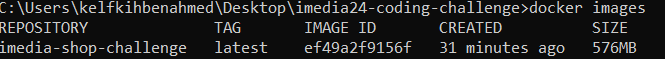
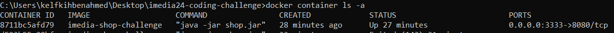

# iMedia24 Coding challenge

### Reference Documentation
For further reference, please consider the following sections:

* [Official Gradle documentation](https://docs.gradle.org)
* [Official Kotlin documentation](https://kotlinlang.org/docs/home.html)
* [Spring Boot Gradle Plugin Reference Guide](https://docs.spring.io/spring-boot/docs/2.4.3/gradle-plugin/reference/html/)
* [Create an OCI image](https://docs.spring.io/spring-boot/docs/2.4.3/gradle-plugin/reference/html/#build-image)
* [Flyway database migration tool](https://flywaydb.org/documentation/)

### Additional Links
These additional references should also help you:

* [Gradle Build Scans – insights for your project's build](https://scans.gradle.com#gradle)

### Imedia shop docker image
Build imedia shop docker image and run it in a docker container:

1- Generate the jar using ./gradlew build or ./gradlew jar

2- On the terminal inside imedia24-coding-challenge folder run the following command :
   "docker build -t imedia-shop-challenge ."
* The docker image is now built.

3- To check wether the image correctly built run the following command : docker images.

The result should be as shown below : 

4- Run the image by the following command : docker run -d -p 3333:8080 imedia-shop-challenge

(-d option to run it on  background mode.)

* Container has been created and it’s running 

5- To test it enter following URL in your browser — http://localhost:3333/products/12

6- To inspect if it is running type the following: docker container ls -a

The result should be as shown below :

7- To stop the application just use Ctrl + C combination